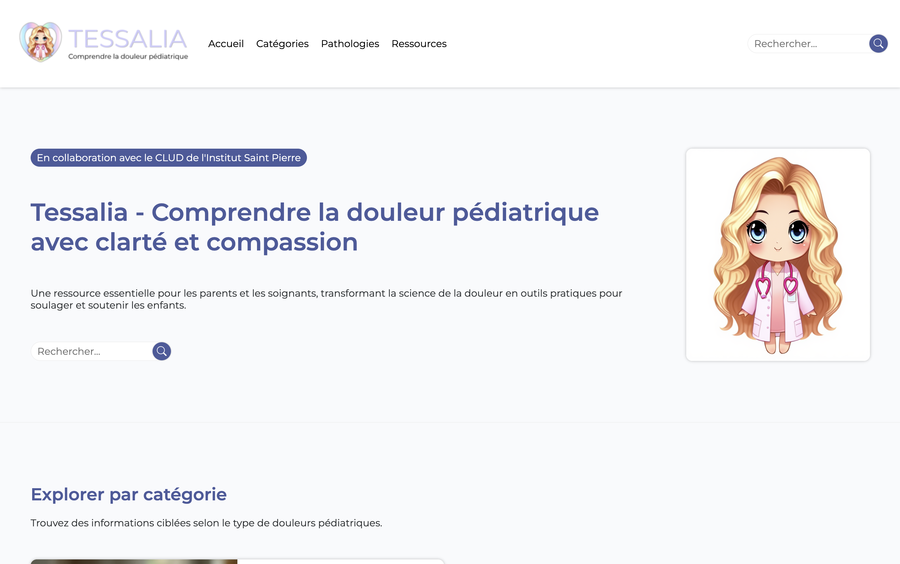
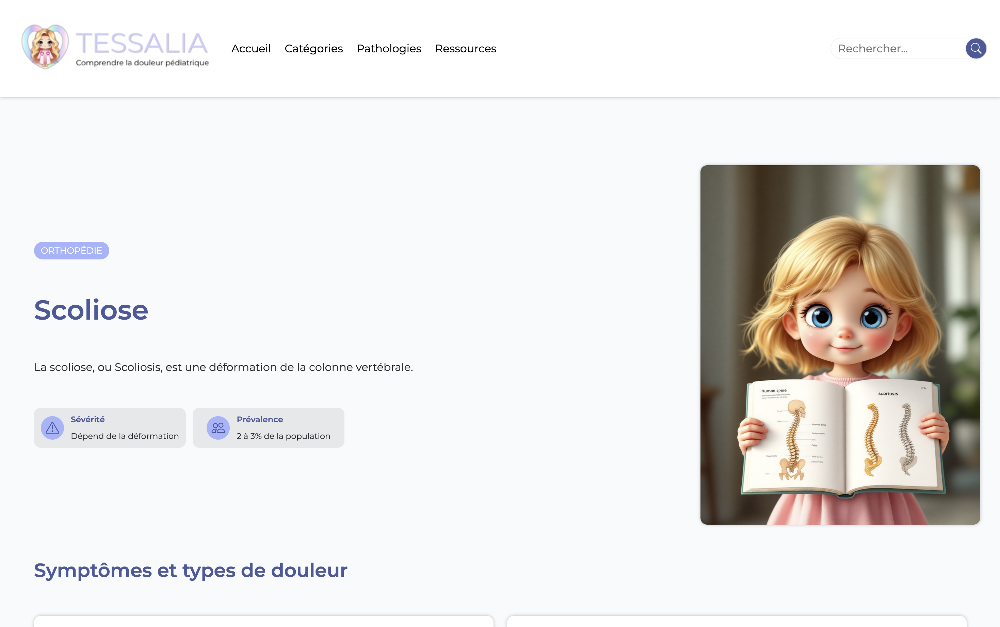

# 🩺 Tessalia


🔗 **Live Demo** : https://tessalia.onrender.com/  
🔗 **Video Demo**:  https://youtu.be/a9a18qfjIFY
⚙️ Application web complète avec interface publique et back-office administrateur
📱 Compatible mobile et desktop


---

## ✨ À propos du projet

**Tessalia** est une plateforme web conçue pour améliorer la prise en charge, l’évaluation et le suivi de la douleur chez les enfants hospitalisés.

Le projet vise à faciliter le travail des professionnels de santé et la compréhension des proches grâce à :

* une encyclopédie des pathologies pédiatriques,
* des ressources adaptées aux soins,
* un futur système de suivi de la douleur,
* et une future interface interactive destinée aux enfants.

Ce projet a été imaginé dans une logique de **résolution d’un besoin réel en milieu hospitalier pédiatrique**.

---

## 🎯 Objectifs

* Centraliser les ressources liées à la douleur pédiatrique
* Faciliter l’accès aux protocoles et fiches de soins
* Structurer les informations médicales par pathologie
* Permettre un meilleur suivi de l’évaluation de la douleur
* Concevoir une application accessible et intuitive

---

## 🧠 Approche technique

Ce projet a été développé avec une attention particulière portée à :

* 🗄️ La modélisation des données relationnelles
* 🔎 La navigation et la recherche d’informations
* 🧩 L’architecture modulaire Django
* 📱 L’accessibilité et le responsive design
* 🔐 La sécurité et la maintenabilité

---

## 🛠️ Stack technique

### Backend

* Python 3
* Django
* SQLite

### Frontend

* HTML5 (Jinja2)
* CSS3
* Django Templates
* JavaScript léger (pour animation du menu de navigation en mode responsive)

### Fonctionnalités backend

* Gestion des pathologies pédiatriques
* Relations entre symptômes, soins et pathologies
* Génération dynamique des pages
* Gestion des médias et documents

### Outils

* Git / GitHub
* VS Code

---

## ⚡ Features

* Encyclopédie des pathologies pédiatriques
* Fiches détaillées de prise en charge
* Ressources téléchargeables
* Organisation par catégories
* Système de recherche
* Interface responsive
* Gestion des médias

---

## 🗂️ Structure des données

Le projet repose sur plusieurs modèles relationnels :

* Category
* Pathology
* Symptom
* Care
* Resource

Les relations Many-to-Many permettent de réutiliser :

* les symptômes,
* les soins,
* les ressources,
entre plusieurs pathologies.

---

## 📸 Aperçu




---

## 🔒 Sécurité

* Validation des fichiers uploadés
* Protection CSRF intégrée via Django
* Gestion sécurisée des formulaires
* Séparation logique des données

---

## 🚀 Lancer le projet en local

1. Cloner le repository

```bash
git clone https://github.com/pmezouar/tessalia.git
cd tessalia
```

2. Créer un environnement virtuel

```bash
python -m venv venv
source venv/bin/activate
```

3. Installer les dépendances

```bash
pip install -r requirements.txt
```

4. Effectuer les migrations

```bash
python manage.py makemigrations
python manage.py migrate
```

5. Lancer l’application

```bash
python manage.py runserver
```

---

## 🚀 Évolutions prévues

* Système d’authentification
* Dashboard professionnel de santé
* Génération de QR codes patients
* Module interactif "Tessa"
* Évaluation de la douleur en temps réel
* Suggestions de soins non médicamenteux
* Notifications et suivi patient

---

## 💼 Auteur

Développé par Priscilla MEZOUAR

🌐 Portfolio : https://pmezouar.github.io
💼 LinkedIn : https://www.linkedin.com/in/pmezouar
📧 Email : [mezouar.priscilla@gmail.com](mailto:mezouar.priscilla@gmail.com)

---

⭐ Ce projet a été développé dans une démarche mêlant technologie, accessibilité et amélioration de la prise en charge pédiatrique. N’hésitez pas à explorer le projet et à me faire des retours !